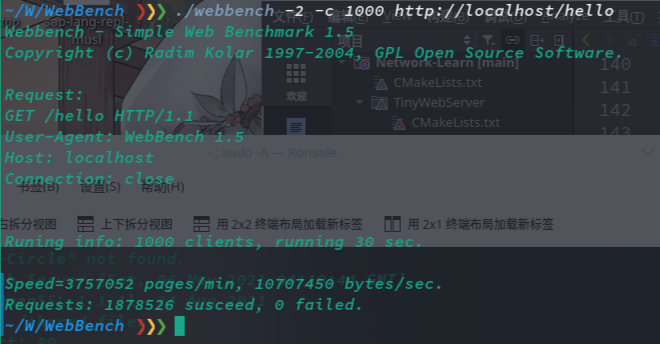
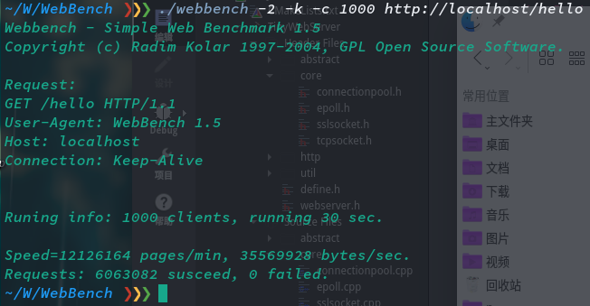

# Tiny Web Server

This is a tiny and fast `HTTP/HTTPS` web server in `C++17`.

The idea of doing this project originated from the TinyWebServer of CS:APP, I hope to learn network programming from this project.

## Features

* Cross-platform: works on Windows and Linux
* Support SSL/TLS
* Basic `HTTP 1.1` support and some other features like `keep-alive`, `range` and `cache-control`
* Support gracefully closing of connections
* Support slow close like `Nginx` smooth upgrade
* Use timer to close timeout connections
* Use `POSIX` thread-safety methods to reduce lock usage
* Using Epoll(Linux) edge-triggered IO multiplex, non-blocking IO, multithreading

## Usage

* Terminal

    ```shell
    Usage: ./TinyWebServer [http-port] [https-port] [shared-directory] [certificate-file] [privateKey-file]

    example: ./TinyWebServer 80 443 ./shared_files
    ```

* After that, you can use `http(s)://localhost/<uri>` to access files in shared folder. BTW, your can also access the default services like `/hello` and `/adder`.

## Webbench

> CPU: Intel i5-7500 3.40GHz x 4  
> RAM: 8GB  
> OS: Manjaro KDE

* Short connection



* Keep alive



## WebServer Demo

```cpp
#include "webserver.h"
#include "http/httpservices.h"

int main()
{
    auto server = std::make_unique<WebServer>();
    auto services = new HttpServices();

    server->setServices(services);

    // 'Adder' Service
    services->onGet("/adder", [](HttpRequest *req, HttpResponse *resp) {
        int sum = 0;
        for(const auto& arg : req->urlArguments())
            sum += atoi(arg.second.c_str());

        resp->setRawHeader("Content-type", "text/html; charset=utf-8");
        *resp << "<html><title>Tiny Web Server</title><body bgcolor\"#fffff\">"
                 "<h1>Tiny Web Server / Adder</h1><p>Result: "
                 + std::to_string(sum) + "</p></body></html>\n";
    });

    server->listen("localhost", 80);    // HTTP
    return server->exec();
}
```

For more complete example, see [main.cpp](./src/main.cpp).
